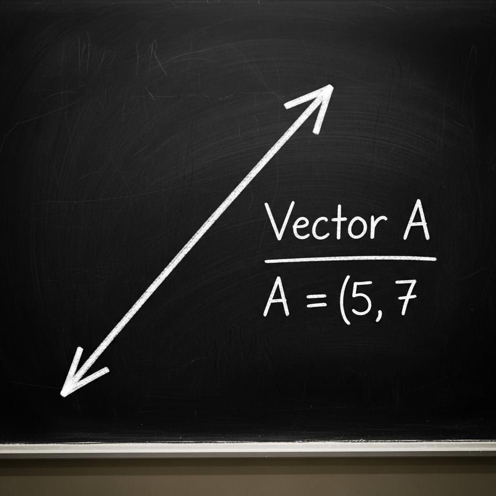
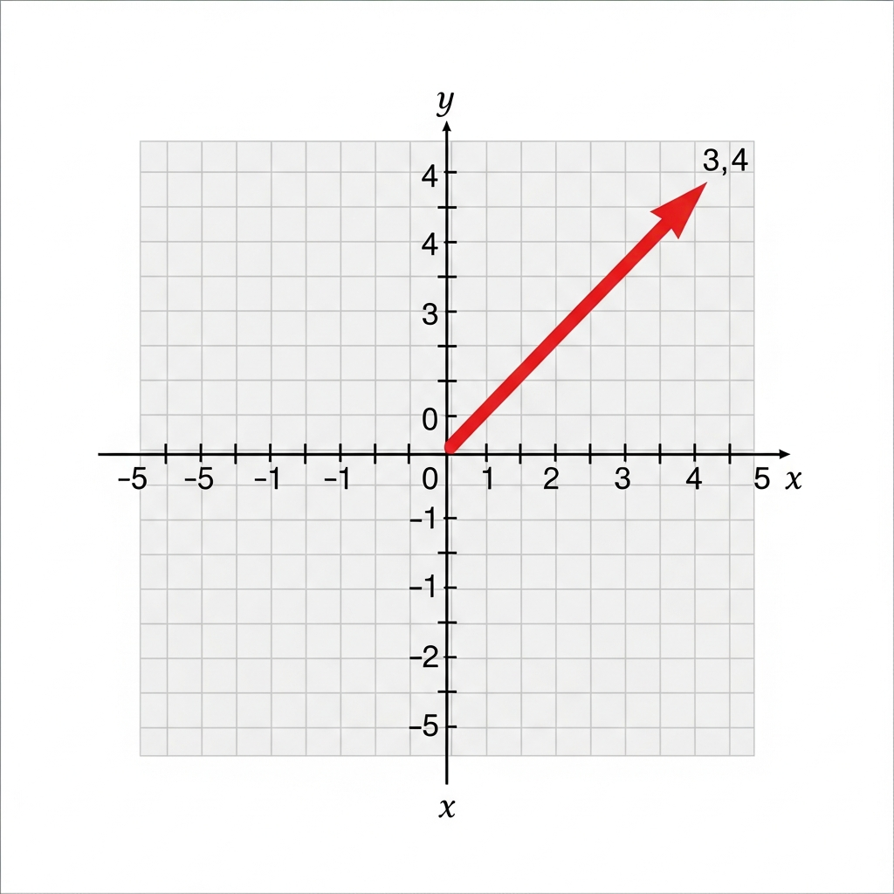
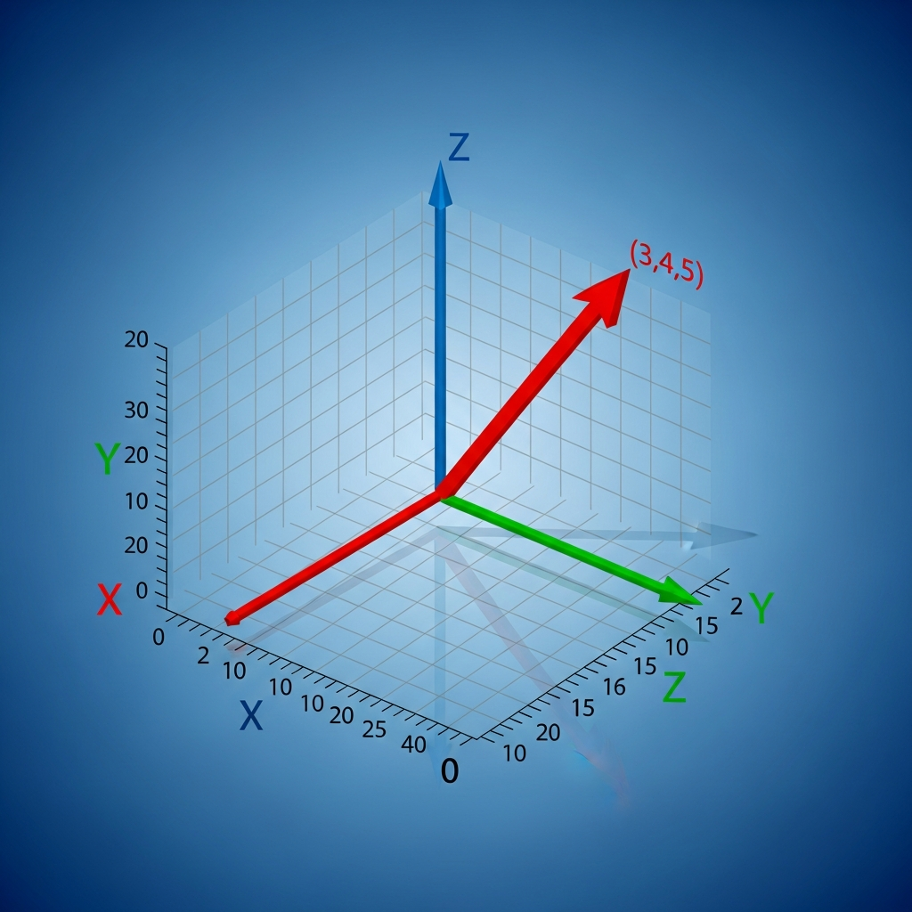
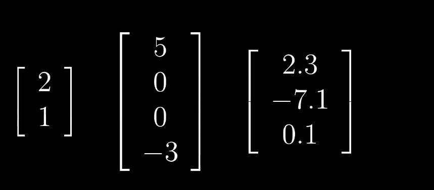
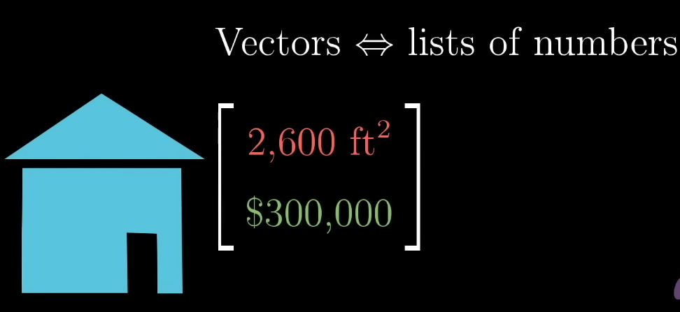
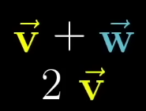
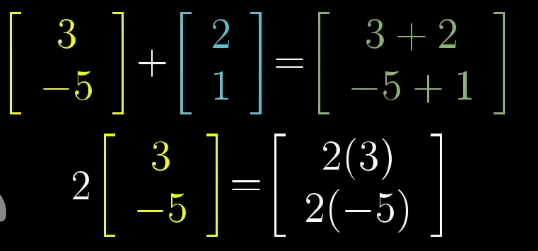
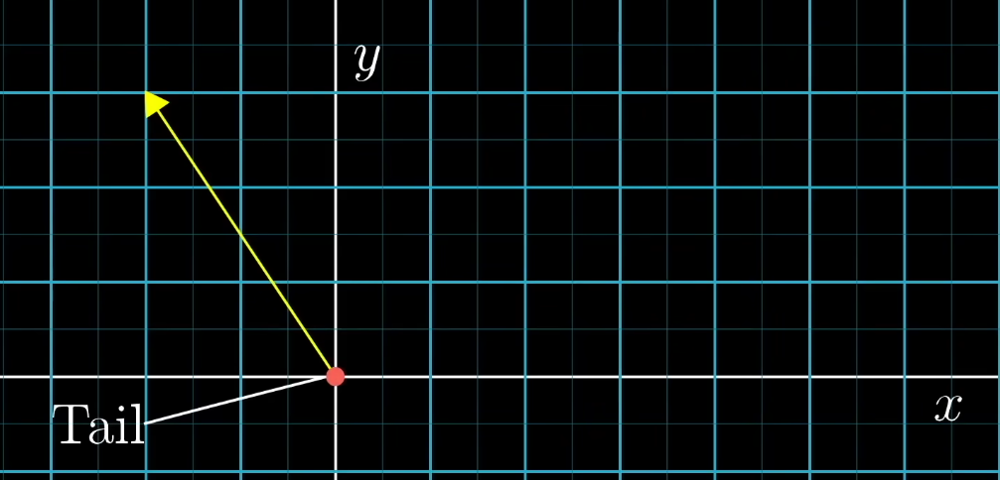
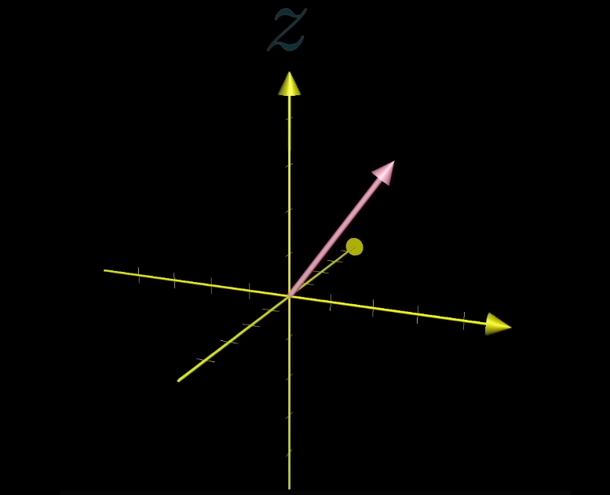

# 3Blue1Brown Lec 1: Vectors

| " The Introduction of number as coordinates is an act of voilence" - Hermann Weyl

---
The fundaments   or root of building block for linear algrbra is `vector`.

So what is a vector ?

based on physics student vector is a arrow pointing in  spaces.

What define vecoor is it's length and its direction it is pointing.

vector that lives in a flat plane are two dimensional.

and those vector that lives in a border space like we live are three dimensional.

fron compu ter sicience pov:

vector are ordered list of numbers.

for example:

in  the above senario a vector is pretty much a list of two dimensional and  it being two dimensional is cause of a reason it have the lenght of two.

from mathematicial pov:

a vector can be anything  where there is a sensible notion of adding two vector or multiplying avector by a number. and it is kind of abstract.

so when we think of a vector we should visualize it as an arrow in a coorodinate system like xy-plane where the tail sits in the origin.

from the physic pove we know the vector can be free and can sit in any place around the xy- plane but in the linear algebra  it is always almos t the case that the vector is root at the orign.

the placewhere x and y line intersect is called the orign we cna say the center of space or root of all vectors.

now the coordinate ofa number  in a vector are basically the instruction given on how ot get from the tail of the vector at the origin to the tip.

to distinguisht it from the point is to use the square brackets like this [ ] .

Every pair of number gives you one and only one vector and every vector is associated with one and only one pair of numbers.

what aobut the third dimensions:

we have a 3 axis or we can say xyz-plane.

name z -axies whihc is perpendicular to the both x and y axis.
and in this case each vector is associate with the order of triplet of number [1 2 3] || [x y z].

like above every triplet number gives a unique one vector in space. and every vector gives one triplet of numbers.

Now on the vector addition and multipication:

addition in simle term just as we do a simple sum we do that case in the vector. one good way is lke this supose we have a vector lets say [1 2] and [3 4] then the addition will be like [4 6] right.

visually we ca do it like this ploting the vector in graph lets say [ 1 2 ] then taking the y corrdinate (1,2) as teh origin and ploting the (3 ,4) the point it comes in is the sum of two vector point you can try if you have a graph paper or a cooridnate space .

multiping mans either streacting the vector or squishing it down.
or fliping if we multiply by negitive number  over all we called this process a `scalling` .

so in linear algrable the number like [2, -1 or 1/3] we called it a scalar wher ewe multilpy each componet by a scale 
