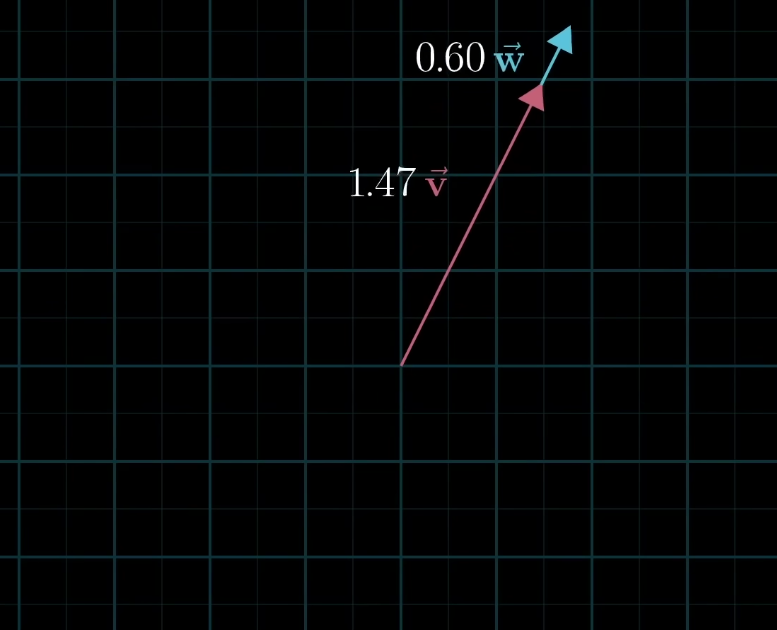
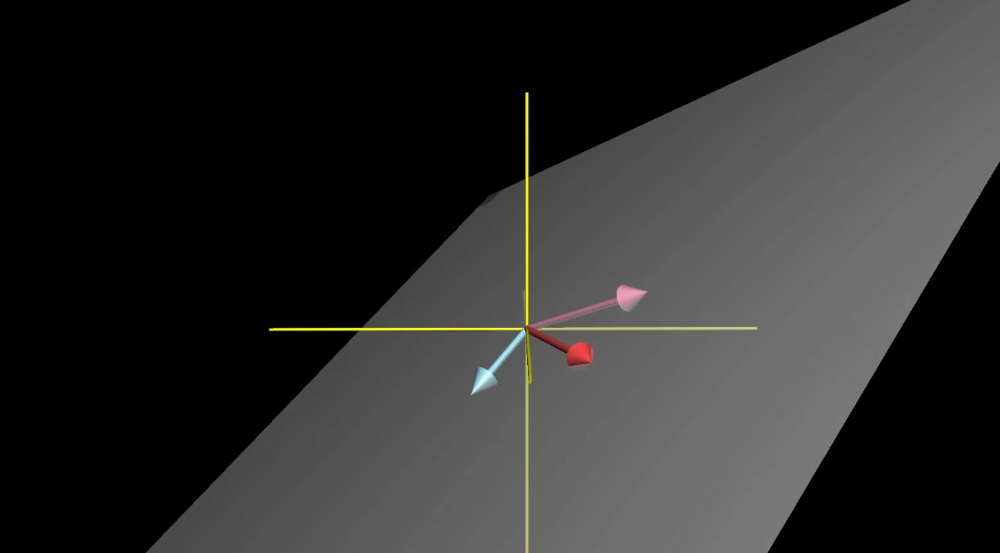

# 3Blue1Brown Lec 2: Linear Combination, Span, and Vector Basis.

IN vector we should think of each cooridates as a scaar where each point either sreatch , squishes vectors

in xy plane we have a special vector callled unit vector or we can say i hat and j hat with both lenght 1. now we can take the coordinatoe or our vector like x and y value as a scalar that scales the i and y hat.

which means it describe the sum of two scaled vectors.

i and j hat are the basic vectors` of the xy coordinate system.

they are called teh basic of coordinate system.

what if we choice different basis vector?

linear combination of v and w vector is av + bw where a and b are scalar.

if one of the point is lets say fix and the other one is free  then the tip of the vector will form a straight line.

if we leave both vector free then we  will rech every point or coridinae inteh xy plane. and in some case if i have a vector on top of that tip is another vector then it will only be limitd to just a sinlge line eaxcmple.:

if both bvector is zero then we will be stuck in the origin.

the set of all the possible  vector that we can reach with a linear ombination of a given vector is called a span of those two vector.

which mean the set of all the linear combintions.
av + bw where a nad b are all real numbers.

so span of 2 vector is basically askinghat possivble set of outcomes you can reahc with the basic vector operation like addition and multiplicsation.

vector vs points
 in  a tow vector line up the it s span is jsut limit ot the line and most of the base a spam of the vector is all teh space in two dimensionspaces.

 in case of the 3 d plane if we have 2 vector free let say x and y the n the span of the vecor or the linear combination will fall in a aeral like a plan of sheet . and if all of them are free then we can access all of teh point in the 3d space als if the third axis is free but fall in the same point  as in x or y point then the third axess point doesnot matter as it will fall in that single sheet lke plane.

 

 if we have a vector her removing the other vector does not affect the span of the two vector then in that case we say that the two vector are linear depentend.

 in each vector addd another dimensio to a span then that vector is a linearly indepentent.

 The basis of a vector space is a set of linearly indepent vectors that span the full space.

 
