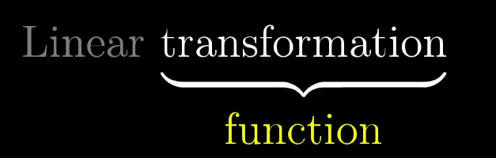

# 3Blue1Brown Lec 3: Linear Transformation and Matrices

Linear transformation with it s relation to the matrices:

transformation is a fancy word for function 

A function is something that takes in a input and split oit a output for each one.

in linear algrbra we  think of linear transformation of takign in some vector an giving out somr vector.

a transformatio is linear if it have two properties:

- all lineas must remail line  no curve
- origin must be same. mean fix.

so in togt her linear transformation is a way to move in a space such that hte gtid  are evenly form and are paralle to each otehr.

